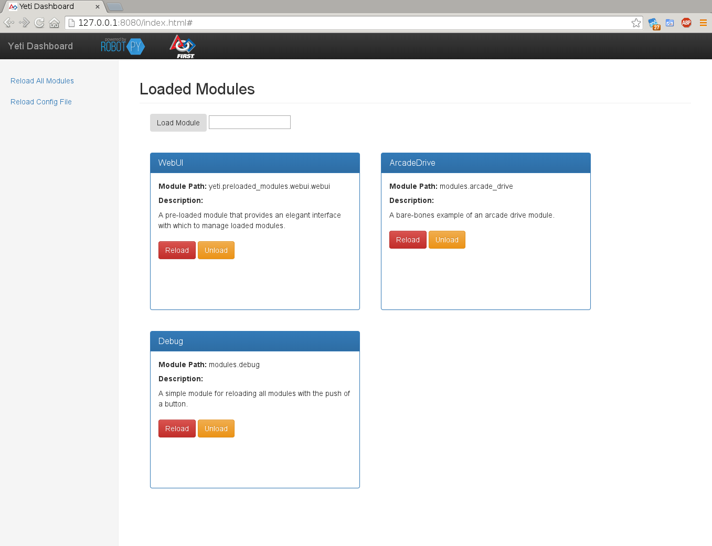

Getting Started
===============

What is yeti?
-------------

Yeti is a Python runtime framework designed for use on FIRST Robotics Competition Robots.
Yeti effectively isolates the robot-specific python code of your robot into "Modules" --
independent python files dynamically loaded at run-time. Modules can be freely loaded,
unloaded, replaced, and modified at any time. This allows you to easily build structured
robot programs, with mechanisms to promote rapid development and in-game failure recovery.

.. note:: This guide assumes some familiarity with RobotPy and python in general.

          If this is the first you have heard of RobotPy, you can read about it here:
          `About RobotPy <http://robotpy.github.io/about/>`_

.. note:: Yeti uses asyncio, which is an asynchronous library that comes default
          with python. Some knowledge of asyncio would definitely be helpful, but not entirely
          necessary for this guide.

          You can read more about asyncio here: `Asyncio Documentation <https://docs.python.org/3.5/library/asyncio.html>`_

Installing Yeti
---------------

Yeti can be installed with pip, or with the robotpy installer.

With the robotpy installer
::

   #Connected to internet
   python3 installer.py download yeti

   #Connected to RoboRIO
   python3 installer.py install yeti

Or with pip
::

   pip install yeti

Using Yeti
----------

Yeti comes with a base robot class :class:`yeti.YetiRobot` you can use to quickly start using yeti. To start,
add the following code to your robot.py.

.. literalinclude:: ../../examples/basic_example/robot.py

Building Modules
----------------

A Basic Example
^^^^^^^^^^^^^^^

Here is a basic example for a drivetrain module. It contains all of the code required for reading values from joysticks, and driving a two-motor chassis.

.. literalinclude:: ../../examples/basic_example/modules/arcade_drive.py

The Module Object
^^^^^^^^^^^^^^^^^
The module itself is a class inheriting from the base module type: :class:`yeti.module`.

module_init
^^^^^^^^^^^
This is called upon module startup. Here is where you should initialize all of your wpilib refrences, and perform all
startup operations.

::

     def module_init(self):
        #Setup a joystick
        self.joystick = wpilib.Joystick(0)

        #Setup the robotdrive
        self.robotdrive = wpilib.RobotDrive(0, 1)

default functions
^^^^^^^^^^^^^^^^^
The simplest way to add functionality to a module is by defining the standard functions that you would normally use in
IterativeRobot.

The following functions are available
::
    enabled_init()
    enabled_periodic()
    teleop_init()
    teleop_periodic()
    autonomous_init()
    autonomous_periodic()
    disabled_init()
    disabled_periodic()

async functions (coroutines)
^^^^^^^^^^^^^^^^^^^^^^^^^^^^
.. note:: In breif, asyncio coroutines are fake threads. They have their own train of execution, deferring control
          whenever they "await" something. To define a coroutine, use "async def my_function(self, etc)"
          as seen below. For more information, read the "Asyncio Documentation"

This cannon example module demonstrates using async functions in yeti.

.. note:: Rather than using python's native time.sleep() or wpilib's Timer.delay() within coroutines, always
          use `await asyncio.sleep()`, which allows other coroutines to execute.

.. literalinclude:: ../../examples/basic_example/modules/cannon.py

triggers
^^^^^^^^

In this example, :object:`self.triggers` links to the "triggers" default module, and is available to all modules by
default. The triggers module contains utilities such as :meth:`on_rising_edge()` to make working with coroutines easier.

Module Communication
^^^^^^^^^^^^^^^^^^^^
You can obtain any running module object by calling `self.engine.get_module("my_module")`.

Error Recovery
^^^^^^^^^^^^^^
One of the key features of yeti's modular system is how it handles module failure. In the yeti config file, you can
define "module sets". Aside from acting as
exception is thrown from within a module, the offending module is immediately unloaded.

However, if that module is referenced in a fallback list, the next entry on the list is immediately loaded in it's
place. The reasoning behind this is to allow you to build, say, an "AwesomeDrive" module, with all of the fancy
functionality possible. But if this were to fail, you could have a "BasicDrive" ready to take its place -- allowing
your robot to cleanly recover from what would have been match-stopping errors.

Config File
-----------

Yeti uses a yaml config file, "yeti.yml", located alongside your robot.py to specify what modules to load at startup
and to define "module sets"

Here is the yeti.yml for the arcade drive and cannon modules shown above:

.. literalinclude:: ../../examples/basic_example/yeti.yml

Module sets
^^^^^^^^^^^
In yeti.yml, you can join multiple, interchangeable modules into a "module set". The benefit of this is that, if any
module in a set were to fail, another may be loaded to replace it. For example -- you could have three available drivetrain
modules: advanced_can_mecanum, basic_can_mecanum, and arcade_drive. Each of these modules would be capable of running
the drivetrain of your robot, but could each have different features. When yeti starts the "drivetrain" module set, it
will attempt load the first module on the list, advanced_can_mecanum. If this module raises an exception, yeti will
automatically load the next module on the list, basic_can_mecanum.

Deploying Code
--------------
RobotPy code making use of Yeti can be deployed the same as any RobotPy application. By running:
::

    python3 robot.py deploy

As with any RobotPy application, this will stop and remove any currently running application, then upload and re-start
your new one. Sometimes, in an application such as yeti, this is unnecessary. When you only want to upload changes to
modules, you can use pyfrc's "--in-place" flag. You can then use the WebUI to reload just the modules you modified --
without even changing robot game mode!
::

    python3 robot.py deploy --in-place

Yeti WebUI
----------
Yeti comes preinstalled with a convenient WebUI, where you can control what is
going on with loaded modules. From here you can load, unload, and reload any module
with the click of a button.

To run the webui, set "yeti.preloaded_modules.webui" to load from your module
config file. The http server will start up on port 8080, and you should be able
to reach it at <computer_ip>:8080/index.html .

.. toctree::
    :hidden:

    building_robot_file